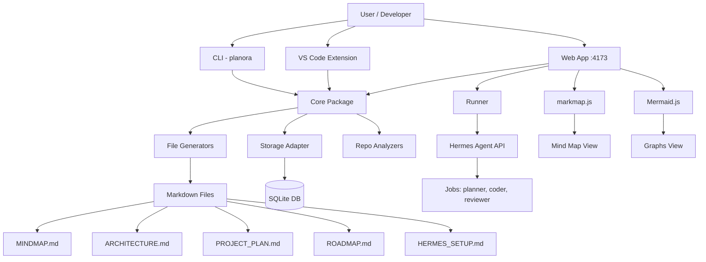
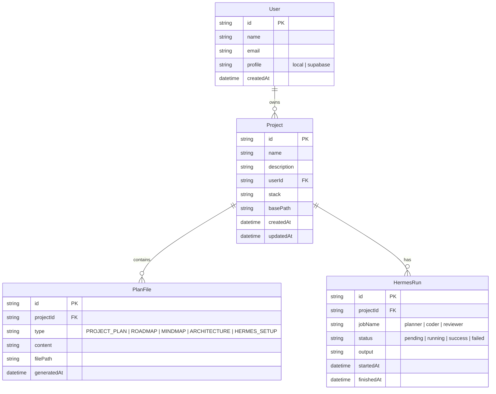
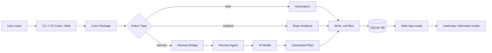

# Planora — Architektura Techniczna

## Monorepo Structure

```
Planora/
├── package.json              # root: workspaces, scripts
├── tsconfig.base.json        # shared TS config
├── .eslintrc.cjs
├── .prettierrc
├── .gitignore
├── packages/
│   ├── core/                 # @planora/core
│   │   ├── package.json
│   │   ├── tsconfig.json
│   │   └── src/
│   │       ├── index.ts               # barrel export
│   │       ├── models/
│   │       │   ├── project.ts
│   │       │   ├── user.ts
│   │       │   ├── plan-file.ts
│   │       │   └── hermes-config.ts
│   │       ├── generators/
│   │       │   ├── project-plan.ts
│   │       │   ├── roadmap.ts
│   │       │   ├── mindmap.ts
│   │       │   ├── architecture.ts
│   │       │   ├── hermes-setup.ts
│   │       │   └── planora-json.ts
│   │       ├── storage/
│   │       │   ├── adapter.ts          # interface
│   │       │   ├── sqlite.ts           # SQLite impl
│   │       │   └── supabase.ts         # Supabase impl (future)
│   │       ├── analyzers/
│   │       │   ├── repo-analyzer.ts    # czyta istniejące repo
│   │       │   └── stack-recommender.ts
│   │       └── utils/
│   │           ├── mermaid.ts          # Mermaid block builder
│   │           ├── markdown.ts         # MD utilities
│   │           └── id.ts              # UUID gen
│   │
│   ├── cli/                  # @planora/cli
│   │   ├── package.json
│   │   ├── tsconfig.json
│   │   └── src/
│   │       ├── index.ts               # entry point
│   │       ├── commands/
│   │       │   ├── init.ts
│   │       │   ├── plan.ts
│   │       │   ├── analyze.ts
│   │       │   ├── roadmap.ts
│   │       │   ├── mindmap.ts
│   │       │   ├── hermes.ts
│   │       │   └── web.ts
│   │       └── utils/
│   │           ├── logger.ts
│   │           └── prompts.ts
│   │
│   ├── vscode-ext/           # @planora/vscode-ext
│   │   ├── package.json
│   │   ├── tsconfig.json
│   │   └── src/
│   │       ├── extension.ts
│   │       ├── commands/
│   │       │   ├── generate-plan.ts
│   │       │   ├── generate-roadmap.ts
│   │       │   ├── generate-mindmap.ts
│   │       │   └── open-webview.ts
│   │       └── webview/
│   │           └── panel.ts
│   │
│   ├── web/                  # @planora/web
│   │   ├── package.json
│   │   ├── tsconfig.json
│   │   ├── vite.config.ts
│   │   ├── index.html
│   │   └── src/
│   │       ├── main.tsx
│   │       ├── App.tsx
│   │       ├── routes/
│   │       │   ├── Dashboard.tsx
│   │       │   ├── ProjectView.tsx
│   │       │   ├── MindMapView.tsx
│   │       │   ├── GraphsView.tsx
│   │       │   └── HermesView.tsx
│   │       ├── components/
│   │       │   ├── ProjectCard.tsx
│   │       │   ├── MindmapRenderer.tsx
│   │       │   ├── MermaidRenderer.tsx
│   │       │   ├── HermesStatus.tsx
│   │       │   └── Layout.tsx
│   │       ├── hooks/
│   │       │   ├── useProjects.ts
│   │       │   └── useHermesStatus.ts
│   │       └── styles/
│   │           └── globals.css
│   │
│   └── runner/               # @planora/runner
│       ├── package.json
│       ├── tsconfig.json
│       └── src/
│           ├── index.ts
│           ├── hermes-bridge.ts       # komunikacja z Hermes API
│           └── job-runner.ts          # wykonuje joby Hermesa
│
├── plans/                    # 📁 ten folder — plany projektu
└── plan.txt                  # oryginalny brief
```

---

## Architecture Diagram



---

## Data Model



---

## Data Flow



---

## Key Design Decisions

| Decyzja | Powód |
|---------|-------|
| Markdown jako source of truth | Przenośny, czytelny w każdym edytorze, łatwy do wersjonowania w git |
| markmap + Mermaid zamiast własnego renderera | Dojrzałe biblioteki, działają z Markdown, duża społeczność |
| SQLite na start | Zero konfiguracji, jeden plik, idealne na local-first |
| Monorepo z 5 pakietami | Separacja odpowiedzialności, core współdzielony przez CLI/VSCode/Web |
| TypeScript strict | Type safety, lepsze IDE support, mniej bugów |
| Core jako CJS + ESM dual build | Kompatybilność z CLI (Node) i Web (Vite) |
