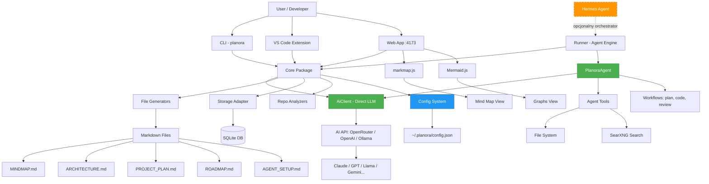
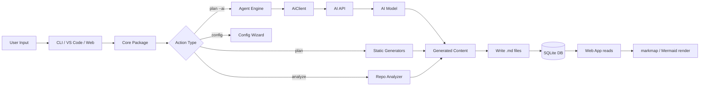
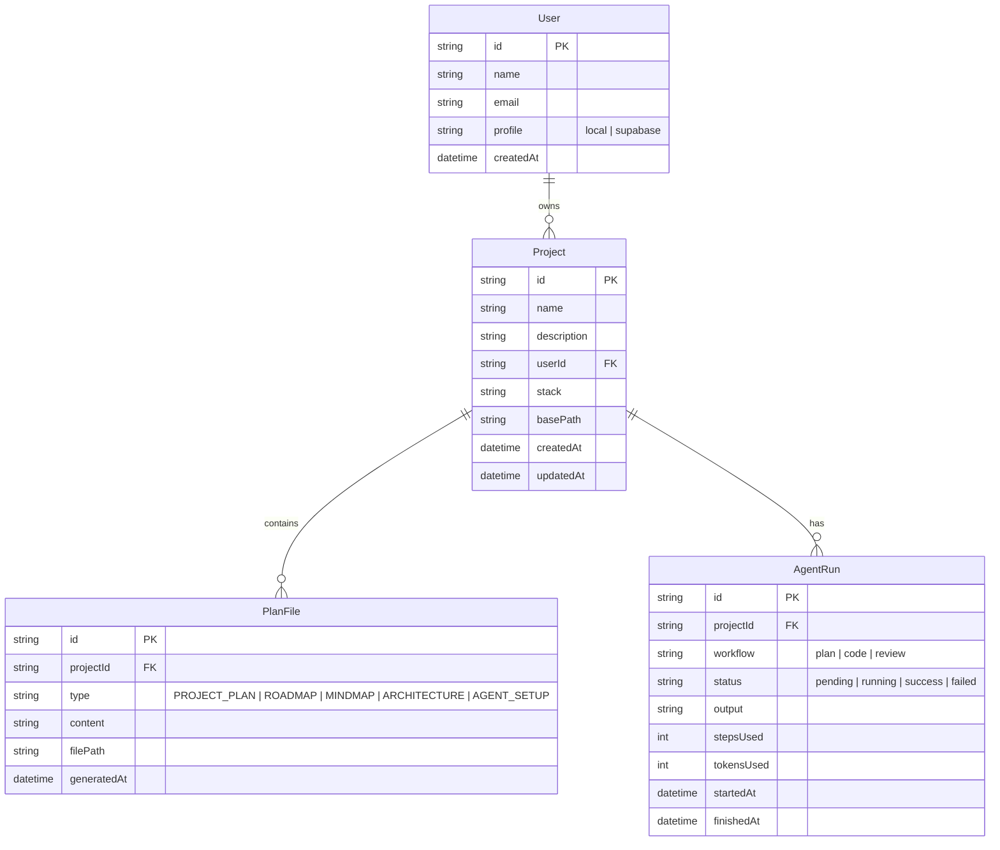

# Planora — Architektura Techniczna

## Monorepo Structure

```
Planora/
├── package.json              # root: workspaces, scripts
├── tsconfig.base.json        # shared TS config
├── .eslintrc.cjs
├── .prettierrc
├── .gitignore
├── packages/
│   ├── core/                 # @planora/core
│   │   ├── package.json
│   │   ├── tsconfig.json
│   │   └── src/
│   │       ├── index.ts               # barrel export
│   │       ├── models/
│   │       │   ├── project.ts
│   │       │   ├── user.ts
│   │       │   ├── plan-file.ts
│   │       │   └── agent-config.ts    # ← NOWY: PlanoraConfig zamiast HermesConfig
│   │       ├── ai/                    # ← NOWA SEKCJA: własny klient LLM
│   │       │   ├── types.ts           #   AiConfig, AiMessage, AiResponse
│   │       │   ├── client.ts          #   AiClient interface
│   │       │   ├── openai-compatible.ts # bazowa implementacja (fetch)
│   │       │   ├── openrouter.ts      #   OpenRouter
│   │       │   ├── openai.ts          #   Direct OpenAI
│   │       │   ├── ollama.ts          #   Ollama (local)
│   │       │   ├── opencode.ts        #   OpenCode
│   │       │   ├── factory.ts         #   createAiClient(config)
│   │       │   ├── errors.ts          #   AiError, RateLimitError, AuthError
│   │       │   ├── retry.ts           #   Exponential backoff
│   │       │   └── index.ts           #   barrel
│   │       ├── config/                # ← NOWA SEKCJA: system konfiguracji
│   │       │   ├── types.ts           #   PlanoraConfig, ProviderConfig
│   │       │   ├── loader.ts          #   read/write ~/.planora/config.json
│   │       │   └── validator.ts       #   walidacja + test połączenia
│   │       ├── generators/
│   │       │   ├── project-plan.ts
│   │       │   ├── roadmap.ts
│   │       │   ├── mindmap.ts
│   │       │   ├── architecture.ts
│   │       │   ├── agent-setup.ts     # ← ZMIANA: AgentSetup (był HermesSetup)
│   │       │   └── planora-json.ts
│   │       ├── storage/
│   │       │   ├── adapter.ts          # interface
│   │       │   ├── sqlite.ts           # SQLite impl
│   │       │   └── supabase.ts         # Supabase impl (future)
│   │       ├── analyzers/
│   │       │   ├── repo-analyzer.ts
│   │       │   └── stack-recommender.ts
│   │       └── utils/
│   │           ├── mermaid.ts
│   │           ├── markdown.ts
│   │           └── id.ts
│   │
│   ├── cli/                  # @planora/cli
│   │   ├── package.json
│   │   ├── tsconfig.json
│   │   └── src/
│   │       ├── index.ts               # entry point
│   │       ├── commands/
│   │       │   ├── init.ts
│   │       │   ├── plan.ts            # ← dodana flaga --ai
│   │       │   ├── analyze.ts
│   │       │   ├── roadmap.ts
│   │       │   ├── mindmap.ts
│   │       │   ├── config.ts          # ← NOWY: wizard AI + zarządzanie configiem
│   │       │   ├── agent.ts           # ← NOWY: agent status, history
│   │       │   ├── hermes.ts          # ← OPCJONALNE: tylko dla power-userów
│   │       │   └── web.ts
│   │       └── utils/
│   │           ├── logger.ts
│   │           └── prompts.ts
│   │
│   ├── vscode-ext/           # @planora/vscode-ext
│   │   ├── package.json
│   │   ├── tsconfig.json
│   │   └── src/
│   │       ├── extension.ts
│   │       ├── commands/
│   │       │   ├── generate-plan.ts
│   │       │   ├── generate-roadmap.ts
│   │       │   ├── generate-mindmap.ts
│   │       │   └── open-webview.ts
│   │       └── webview/
│   │           └── panel.ts
│   │
│   ├── web/                  # @planora/web
│   │   ├── package.json
│   │   ├── tsconfig.json
│   │   ├── vite.config.ts
│   │   ├── index.html
│   │   └── src/
│   │       ├── main.tsx
│   │       ├── App.tsx
│   │       ├── routes/
│   │       │   ├── Dashboard.tsx
│   │       │   ├── ProjectView.tsx
│   │       │   ├── MindMapView.tsx
│   │       │   ├── GraphsView.tsx
│   │       │   └── AgentView.tsx       # ← ZMIANA: AgentView (był HermesView)
│   │       ├── components/
│   │       │   ├── ProjectCard.tsx
│   │       │   ├── MindmapRenderer.tsx
│   │       │   ├── MermaidRenderer.tsx
│   │       │   ├── AgentStatus.tsx     # ← ZMIANA: AgentStatus (był HermesStatus)
│   │       │   └── Layout.tsx
│   │       ├── hooks/
│   │       │   ├── useProjects.ts
│   │       │   └── useAgentStatus.ts   # ← ZMIANA: useAgentStatus
│   │       └── styles/
│   │           └── globals.css
│   │
│   └── runner/               # @planora/runner
│       ├── package.json
│       ├── tsconfig.json
│       └── src/
│           ├── index.ts
│           ├── agent.ts              # ← NOWY: PlanoraAgent — główna pętla
│           ├── session.ts            # ← NOWY: AgentSession — konwersacja
│           ├── history.ts            # ← NOWY: historia runów (SQLite)
│           ├── config.ts             # ← NOWY: loader configu
│           ├── prompts/              # ← NOWA SEKCJA: system prompty
│           │   ├── system.ts         #   bazowy system prompt
│           │   ├── planner.ts        #   prompt planisty
│           │   ├── coder.ts          #   prompt kodera
│           │   └── reviewer.ts       #   prompt reviewera
│           ├── tools/                # ← NOWA SEKCJA: function-calling tools
│           │   ├── index.ts          #   rejestr tooli
│           │   ├── file-read.ts
│           │   ├── file-write.ts
│           │   ├── file-list.ts
│           │   ├── shell.ts
│           │   ├── web-search.ts     #   SearXNG
│           │   └── web-fetch.ts
│           ├── workflows/            # ← NOWA SEKCJA: workflowy agenta
│           │   ├── plan-workflow.ts
│           │   ├── code-workflow.ts
│           │   └── review-workflow.ts
│           └── hermes-bridge.ts      # ← OPCJONALNE: tylko dla multi-agent
│
├── plans/                    # 📁 ten folder — plany projektu
└── plan.txt                  # oryginalny brief
```

---

## Architecture Diagram



> **Legenda:** 🟢 Zielony = własny agent Planory. 🟠 Pomarańczowy = Hermes (opcjonalny).

---

## Data Flow



---

## Data Model



> **Zmiana:** `HermesRun` → `AgentRun`. Dodane `stepsUsed` i `tokensUsed` do śledzenia zużycia.

---

## Key Design Decisions

| Decyzja | Powód |
|---------|-------|
| Markdown jako source of truth | Przenośny, czytelny w każdym edytorze, łatwy do wersjonowania w git |
| markmap + Mermaid zamiast własnego renderera | Dojrzałe biblioteki, działają z Markdown, duża społeczność |
| SQLite na start | Zero konfiguracji, jeden plik, idealne na local-first |
| Monorepo z 5 pakietami | Separacja odpowiedzialności, core współdzielony przez CLI/VSCode/Web |
| TypeScript strict | Type safety, lepsze IDE support, mniej bugów |
| Core jako CJS + ESM dual build | Kompatybilność z CLI (Node) i Web (Vite) |
| **Własny AiClient w core** | Bezpośrednia komunikacja z AI API bez pośrednictwa Hermesa |
| **Hermes jako opcjonalny orchestrator** | Power-userzy mogą używać multi-agent workflowów; reszta działa standalone |
| **Config w ~/.planora/config.json** | Jeden plik, chmod 600, tylko klucz API — nic więcej nie trzeba |
| **Tool-calling przez function calling** | Agent może czytać/ pisać pliki, szukać w necie — wszystko przez natywne API modeli |
