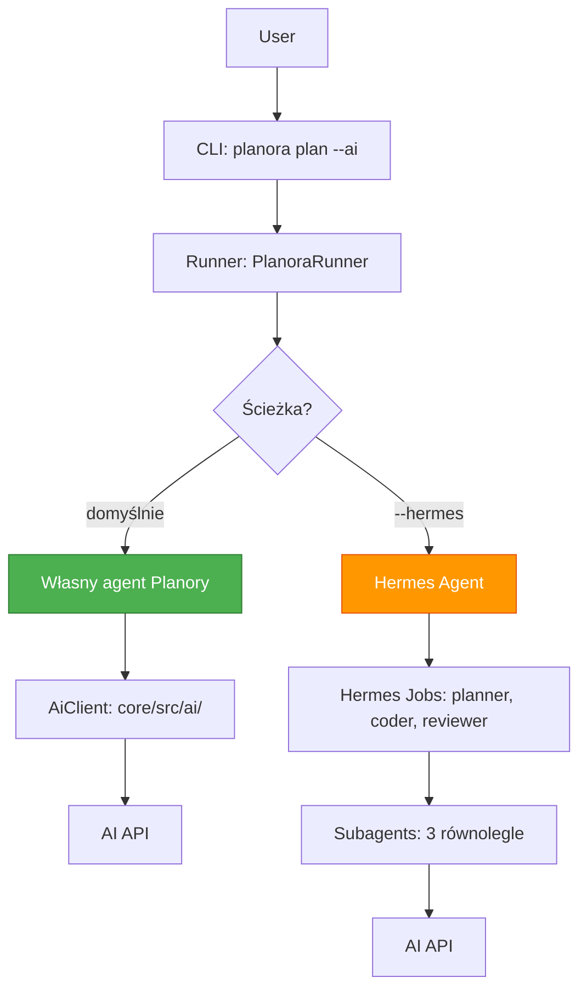

# Planora — Opcjonalna Integracja z Hermes Agent

> **Status:** Hermes jest OPCJONALNY. Planora działa w pełni bez niego poprzez własnego agenta.
> Zobacz `plans/08_OWN_AGENT.md` — specyfikacja własnego agenta.

## Overview

Planora domyślnie używa **własnego agenta AI** zbudowanego na `@planora/core/src/ai/` (AiClient).
Hermes Agent jest dostępny jako **opcjonalny orchestrator** dla złożonych multi-agent workflowów:

| Scenariusz | Mechanizm |
|-----------|-----------|
| Podstawowe planowanie (`planora plan --ai`) | Własny agent Planory |
| Generowanie roadmap, mindmap | Własny agent Planory |
| Code review (pojedyncze) | Własny agent Planory |
| Multi-agent workflow (planner → coder → reviewer) | Hermes orchestrator (opcjonalny) |
| Subagent-driven development (3 coderów równolegle) | Hermes orchestrator (opcjonalny) |

---

## Kiedy używać Hermesa?

Hermes jest potrzebny tylko gdy user chce:
1. **Multi-agent workflowy** — planner → coder → reviewer z subagentami
2. **Równoległe taski** — delegacja do 3 coderów jednocześnie
3. **Cron joby** — automatyczne planowanie/review na timerze
4. **Integracja z messaging** — Telegram, Discord, Slack notify

Dla 90% przypadków wystarczy własny agent Planory (AiClient).

---

## Architektura Dualna



---

## Konfiguracja Hermesa (tylko dla power-userów)

### Instalacja

```bash
# 1. Zainstaluj Hermesa (spoza Planory)
curl -fsSL https://hermes-agent.nousresearch.com/install.sh | bash

# 2. W Planorze: skonfiguruj Hermesa jako dodatek
planora hermes init
```

### Config Wizard

```
$ planora hermes init

  ⚠ Hermes jest opcjonalnym dodatkiem.
  Planora działa w pełni bez niego przez własnego agenta.

  Hermes daje:
  - Multi-agent workflowy (planner → coder → reviewer)
  - Równoległe taski (3 coderów jednocześnie)
  - Cron joby dla automatyzacji

? Czy chcesz skonfigurować Hermesa? (y/N): y

  ✓ Wykryto Hermes Agent v2.4.1
  ✓ Używam tego samego klucza API co Planora (OpenRouter)
  ✓ Tworzę joby: planora-planner, planora-coder, planora-reviewer

  ✓ Hermes skonfigurowany!
    Użyj: planora plan --hermes   (multi-agent)
    lub:   planora plan --ai       (własny agent, domyślnie)
```

---

## Joby Hermesa (opcjonalne)

### 1. planner (multi-agent)

```yaml
name: planora-planner
description: "Multi-agent project planning"
trigger: manual
model: ${PLANORA_MODEL}
skills:
  - planora
prompt: |
  You are an orchestrator. Delegate to subagents to generate:
  1. PROJECT_PLAN.md (architect agent)
  2. MINDMAP.md (mindmap agent)
  3. ARCHITECTURE.md (architecture agent)

  Project: {project_name}
  Stack: {stack}
```

### 2. coder (multi-agent)

```yaml
name: planora-coder
description: "Multi-agent feature implementation"
trigger: manual
model: ${PLANORA_MODEL}
skills:
  - planora
prompt: |
  You are an orchestrator. Delegate coding tasks to subagents.
  Max 3 parallel workers.

  Feature: {feature_description}
  Tech stack: {stack}
```

### 3. reviewer (multi-agent)

```yaml
name: planora-reviewer
description: "Multi-agent code review"
trigger: manual
model: ${PLANORA_MODEL}
skills:
  - planora
prompt: |
  You are an orchestrator. Review code changes using specialized reviewer agents.
```

---

## CLI Commands dla Hermesa

```
planora hermes init      — Konfiguruje Hermesa jako opcjonalny dodatek
planora hermes status    — Status: czy Hermes jest dostępny
planora hermes code      — Uruchamia multi-agent coder
planora hermes review    — Uruchamia multi-agent reviewer
planora hermes history   — Historia runów Hermesa
```

---

## Security Notes

- API key współdzielony między Planorą a Hermesem (z `~/.planora/config.json`)
- Hermes używa tego samego klucza — nie trzeba podawać drugi raz
- Hermes config w `~/.hermes/config.yaml` referencjonuje klucz Planory
