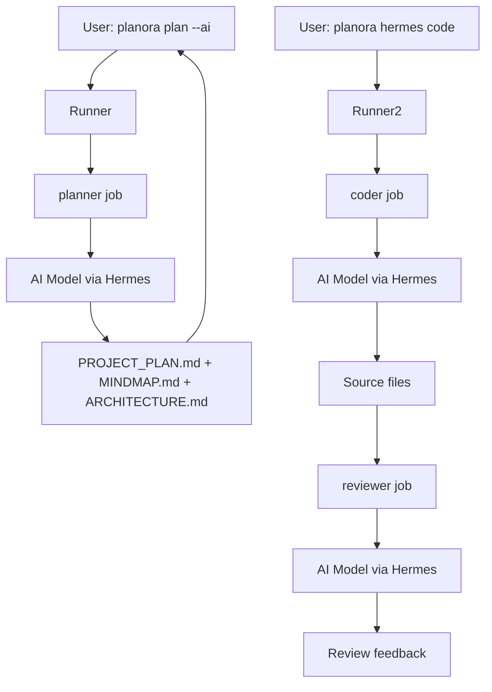

# Planora — Hermes Agent Integration

## Overview

Planora używa Hermes Agent jako silnika AI do:
- generowania planów projektów (przez AI zamiast szablonów),
- implementacji feature'ów (coder job),
- code review (reviewer job),
- rekomendacji stacku technologicznego.

Hermes jest opcjonalny — generatory działają też bez niego (statyczne szablony). Z Hermesem plany są bogatsze, kontekstowe i generowane przez AI.

---

## Architektura integracji

```
Planora (CLI / Web / VS Code)
        |
        v
  @planora/core
        |
        v
  @planora/runner  ------Hermes API------> Hermes Agent
        |                                      |
        v                                      v
  [SQLite: run history]              [AI Model: Claude, GPT, Llama...]
```

Runner to cienka warstwa między Planorą a Hermesem:
- wysyła prompty do Hermesa,
- odbiera wyniki,
- zapisuje historię runów.

---

## Model Configuration

### Providerzy

| Provider | Typ | Konfiguracja |
|----------|-----|-------------|
| **OpenRouter** | Cloud API | `apiKey`, `model` (np. `anthropic/claude-sonnet-4`) |
| **OpenCode** | Cloud API | `apiKey`, `model` |
| **Ollama** | Local | `url` (domyślnie `http://localhost:11434`), `model` (np. `llama3:8b`) |
| **Custom OpenAI** | Dowolny | `url`, `apiKey`, `model` |

### Config Wizard (CLI)

```
$ planora hermes init

? Choose AI provider:
  > OpenRouter (cloud)
    Ollama (local)
    OpenCode (cloud)
    Custom OpenAI-compatible

? API Key: ********

? Default model:
  > anthropic/claude-sonnet-4
    openai/gpt-4o
    google/gemini-pro

? Test connection? (Y/n): y
  ✓ Connected! Model: anthropic/claude-sonnet-4

✓ Hermes configured!
  Config saved to ~/.planora/hermes-config.json
  HERMES_SETUP.md generated
```

### Config file format

```json
{
  "provider": "openrouter",
  "apiKey": "sk-or-v1-...",
  "model": "anthropic/claude-sonnet-4",
  "options": {
    "temperature": 0.7,
    "maxTokens": 4096
  },
  "customUrl": null
}
```

---

## Job Definitions

Planora definiuje 3 standardowe joby Hermesa:

### 1. planner

Generuje pełny plan projektu (PROJECT_PLAN.md, MINDMAP.md, ARCHITECTURE.md).

```yaml
# ~/.hermes/jobs/planora-planner.yaml
name: planora-planner
description: "Generate project plan, mindmap, and architecture docs"
trigger: manual
model: ${HERMES_MODEL}
skills:
  - planora
prompt: |
  You are a project planner. Generate the following for project "{project_name}":

  Tech stack: {stack}
  Description: {description}

  Create:
  1. PROJECT_PLAN.md — overview, MVP, milestones, risks
  2. MINDMAP.md — hierarchical outline for markmap rendering
  3. ARCHITECTURE.md — Mermaid diagrams (system, data flow, components)

  Output each file with its filename as a header.
```

### 2. coder

Implementuje konkretny feature na podstawie planu.

```yaml
# ~/.hermes/jobs/planora-coder.yaml
name: planora-coder
description: "Implement a feature based on project plan"
trigger: manual
model: ${HERMES_MODEL}
skills:
  - planora
prompt: |
  You are a developer implementing a feature for project "{project_name}".

  Project plan: {project_plan_summary}
  Feature to implement: {feature_description}
  Tech stack: {stack}

  Write production-ready code. Follow the project's architecture.
  Create/modify files as needed. Write tests.
```

### 3. reviewer

Code review wygenerowanego kodu.

```yaml
# ~/.hermes/jobs/planora-reviewer.yaml
name: planora-reviewer
description: "Review code changes for quality and correctness"
trigger: manual
model: ${HERMES_MODEL}
skills:
  - planora
prompt: |
  You are a code reviewer for project "{project_name}".

  Review the following changes:
  {diff}

  Check for:
  - Correctness
  - Type safety
  - Architecture compliance
  - Test coverage
  - Performance issues
  - Security vulnerabilities

  Provide actionable feedback.
```

---

## Workflow



---

## Runner Implementation

```typescript
// packages/runner/src/job-runner.ts

import { HermesConfig, HermesRun } from '@planora/core';
import { spawn } from 'child_process';

export class JobRunner {
  constructor(private config: HermesConfig) {}

  async runJob(
    jobName: 'planner' | 'coder' | 'reviewer',
    projectId: string,
    params: Record<string, string>
  ): Promise<HermesRun> {
    const run: HermesRun = {
      id: generateId(),
      projectId,
      jobName,
      status: 'running',
      startedAt: new Date(),
    };

    try {
      // Wywołaj Hermes CLI
      const output = await this.executeHermesJob(jobName, params);
      run.status = 'success';
      run.output = output;
      run.finishedAt = new Date();
    } catch (error) {
      run.status = 'failed';
      run.output = String(error);
      run.finishedAt = new Date();
    }

    // Zapisz run do bazy
    await this.saveRun(run);
    return run;
  }

  private executeHermesJob(
    jobName: string,
    params: Record<string, string>
  ): Promise<string> {
    return new Promise((resolve, reject) => {
      const env = {
        ...process.env,
        HERMES_MODEL: this.config.model,
        HERMES_PROVIDER: this.config.provider,
        ...params,
      };

      const proc = spawn('hermes', [
        'run',
        '--job', `planora-${jobName}`,
        '--json',
      ], { env });

      let stdout = '';
      let stderr = '';

      proc.stdout.on('data', (data) => { stdout += data; });
      proc.stderr.on('data', (data) => { stderr += data; });

      proc.on('close', (code) => {
        if (code === 0) resolve(stdout);
        else reject(new Error(stderr || `Exit code: ${code}`));
      });
    });
  }

  async getRunHistory(projectId: string): Promise<HermesRun[]> {
    return storage.getHermesRuns(projectId);
  }
}
```

---

## Integration Points with Core

```typescript
// packages/core/src/generators/hermes-setup.ts

export function generateHermesSetup(config: HermesConfig): string {
  return `# Hermes Setup for {projectName}

## Model Configuration

- **Provider:** ${config.provider}
- **Model:** ${config.model}
- **Status:** ${config.tested ? 'Connected ✓' : 'Not tested'}

## Jobs

### planner
Generates project plan, mindmap, and architecture docs.

Trigger: \`planora plan --ai\` or manual via Hermes CLI.

### coder
Implements features based on the project plan.

Trigger: \`planora hermes code --feature "..."\`

### reviewer
Reviews code changes for quality and correctness.

Trigger: \`planora hermes review\`

## Workflow

1. User runs \`planora plan --ai\` → triggers planner
2. Planner generates all .md files
3. User runs \`planora hermes code --feature "X"\` → triggers coder
4. Coder implements feature
5. User runs \`planora hermes review\` → triggers reviewer
6. Reviewer provides feedback

## Configuration File

\`\`\`json
${JSON.stringify(config, null, 2)}
\`\`\`

## Environment Variables

- \`HERMES_PROVIDER\` — AI provider
- \`HERMES_MODEL\` — model name
- \`HERMES_API_KEY\` — API key (for cloud providers)
- \`HERMES_LOCAL_URL\` — Ollama/custom endpoint
`;
}
```

---

## CLI Commands for Hermes

```
planora hermes init      — First-time setup wizard
planora hermes status    — Show current config + connection test
planora hermes config    — Show/edit config
planora hermes code      — Run coder job for a feature
planora hermes review    — Run reviewer job
planora hermes history   — Show run history for project
```

---

## Security Notes

- API key przechowywany lokalnie w `~/.planora/hermes-config.json` (0600 permissions)
- Nigdy nie commitowany do repo (dodany do `.gitignore`)
- Opcjonalnie: systemowy keychain zamiast plaintext (future enhancement)
